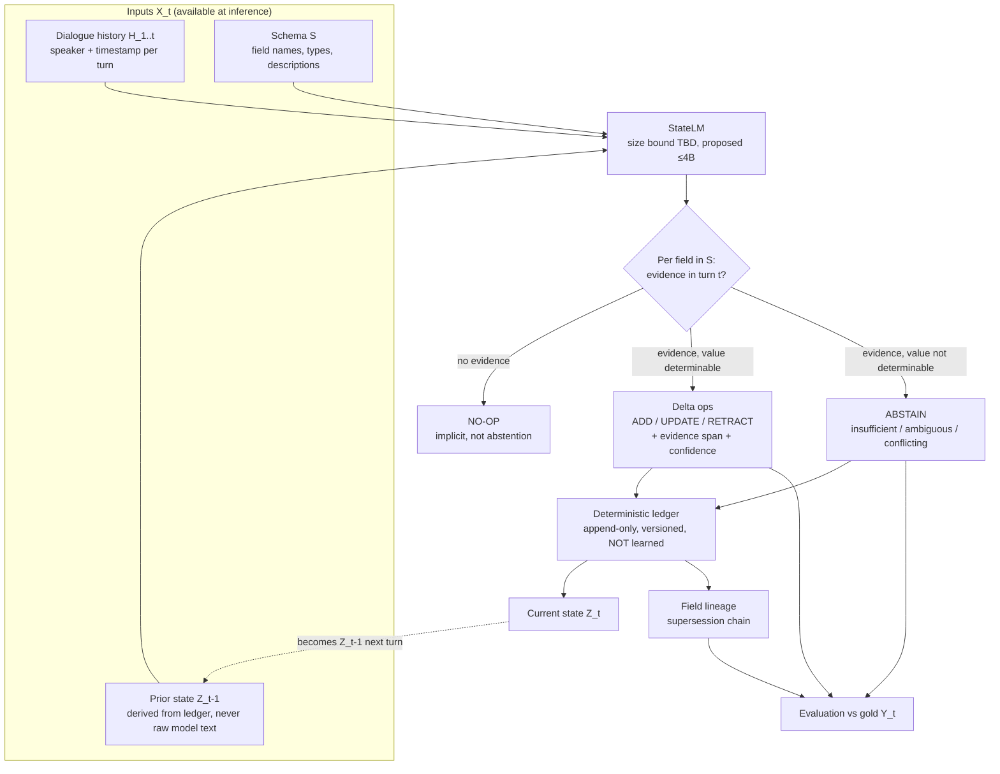
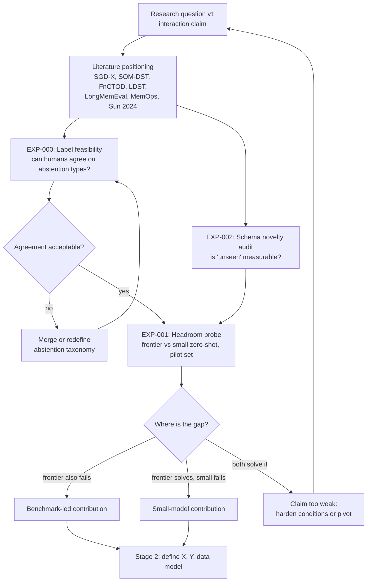

# Architecture (current agreed system)

This file shows only what has been decided or formally proposed. It is not a wish list.
Every diagram node must trace to an ADR or to `research-question.md`.

Status: everything below is **Proposed** until ADR-001..003 are accepted.

## 1. System Architecture (v0.1, problem level)

## 2. Training / Data Pipeline

Not drawn. Depends on Stage 2 (X, Y) and Stage 3 (data model). Drawing it now would invent decisions.

## 3. Evaluation Pipeline

Not drawn. Depends on Stage 4 (benchmark). Known requirement: evaluate with both gold and
predicted prior state Z_t-1 to measure exposure bias (ADR-002 failure mode).

## 4. Research Experiment Flow (stage gates)

