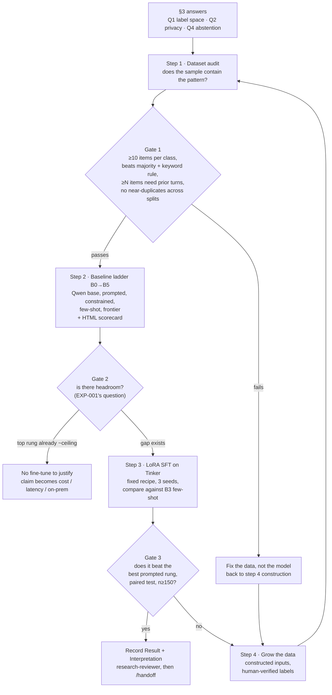

# Plan: from a labelled sample to a measured fine-tune (modelling track)

Date: 2026-10-10 · Author: Claude Code · **Status: proposal. Nothing here is approved.**

> **What this document is.** Kapardhi described, in one session, a sequence he wants: baseline the
> base model, choose LoRA settings, compare against frontier models, analyse whether the labelled
> sample contains the pattern, expand the data, and use Tinker for training. This file turns that
> into an ordered plan with gates, and names every decision in it that is his.
>
> **What it is not.** It is not a Decision, it changes no ADR status, and it adds no row to
> `STATE.md`. No experiment record has been created and no code has been written. Three of the
> steps below cannot start until he answers the questions in **§3**, because they would otherwise
> be built on a guess about what the data is.
>
> Everything marked *Flagged* is Claude Code's reading, not his instruction.

---

## 0. Kapardhi's answers, 2026-10-10

Transcribed verbatim, as he gave them, in answer to the four questions this plan carried when it
was first pushed. They are now his, and the sections below are amended to match. The remaining
questions in §9 are unanswered.

> **Privacy (Q2):** "client. consent is taken and can be used also i g wehave >400 examples"
>
> **The labelled items (Q3):** "Freeze all 100 as evaluation"
>
> **Abstention (Q4):** "Recruit any second annotator"
>
> **Model size (Q5):** "9B becomes the new primary"

Four consequences, each recorded where it bites: §3.1 (the privacy rule now needs amending, and
one question about the scope of that consent stays open), §3.2 (the corpus is larger than 100, so
the split arithmetic is redone), §3.3 (recruiting unblocks EXP-003 but not today, so the interim
label space is an open question), and §6 (9B primary moves D1, and collides with the stated reason
D1 gave for ≤4B).

---

## 1. The seven asks, restated

| # | His words (condensed) | Where it lands below |
|---|---|---|
| A1 | "Establish the baseline score: take the Qwen base model, test the dataset" | Step 2, baseline ladder |
| A2 | "A simple HTML artifact which will tell us, Qwen has passed this test example" | Step 2 deliverable |
| A3 | "Decide rank, and what you are going to tweak: query, keys, multiple weights" | §6, answered by Tinker's own constraints |
| A4 | "Compare Claude / OpenAI, so I can say it beats even Claude on these workflows" | Step 2 rungs B4–B5, and §5 on what that sentence can mean |
| A5 | "Data analysis to figure out whether it really contains the pattern we want to learn" | Step 1, and it is the gate on everything after it |
| A6 | "Another round of the same process: the model infers changes and prepares more data" | Step 4, with a hard constraint from rule 3 |
| A7 | "Use Genesis so that we have the plan up and ready" | §8 |

---

## 2. What is in this repository today

Checked on 2026-10-10 at commit `f73ff9b`.

| Thing he referred to | What the repo actually holds |
|---|---|
| "Complete data labeling and the labeling pipeline" | The **pipeline** exists: `experiments/EXP-000/` (scrubber, sampler, sheet writer, κ/agreement, cue diagnostics, 16 test files). It is built for the **abstention taxonomy**, not for chatbot actions. |
| "We reviewed and categorized and labeled that data" | No labelled set is in the repo, and `data/` does not exist here at all. EXP-000's only agreement run, `20261009T115207Z-a4804a8`, is marked **VOID** (AI-generated sheets) and EXP-000 is **Closed (no result)**. |
| "100 data points, divided into train/test/val" | No `data/splits/`, no `schema_assignment.json`. Under `.claude/rules/data-privacy.md` this is expected if the set is client text: it stays on his machine. But then **nothing in this repo records that it exists, how it was labelled, or by whom.** |
| "The SLM chatbot which we have built" | Not in this repo, and not in `docs/research/`. `research-question.md` forbids CRM integrations in v0.1; the chatbot is a separate product artifact. |
| "What action should have been taken by the chatbot, and what reply it gives" | **This is not the Y defined in `research-question.md`**, which is `{(field, op, value, evidence, confidence)}` with `op ∈ {ADD, UPDATE, RETRACT, ABSTAIN_k}`. Stage 2 ("Define X and Y") is **Not started**. |

*Flagged, and this is the single most consequential item in the table:* an **action + reply** label
space and a **state-delta op** label space are different tasks with different metrics. If the 100
items carry the first, then training on them tests a hypothesis this repository has never written
down, and `architecture.md`, `research-question.md` and ADR-002 do not describe the system being
built. That is a legitimate thing for him to want — but it is a change of research object, not a
next step, and under CLAUDE.md it is his to make explicitly. **Q1 in §9.**

Two decisions taken on 2026-10-09, one day before this plan, bear directly on it:

- **D2: benchmark first, model second** (ADR-001 Accepted). The plan he described is model-first.
- **D1: ≤4B primary**, size curve at ~1B / ~4B / ~8B. He now asks for a 9B primary.

Neither is a reason not to do what he wants. Both are reasons to say out loud which one is moving.

---

## 3. Three things that must be settled before any training token is spent

### 3.1 Sending this data to Tinker, Claude or OpenAI may be forbidden by our own rule

`.claude/rules/data-privacy.md`, which applies to every session:

> Client conversation text never leaves Kapardhi's machine. It is never requested, read,
> committed or uploaded, **scrubbed or not**.

Tinker, the Anthropic API and the OpenAI API are all external services. Training on client-derived
text means uploading it. Tinker's own data model confirms the upload is durable and
org-scoped: training data produces checkpoints and runs owned by a *project*, a session with no
`project_id` lands in the **Default project** which carries an org-wide read grant, and deleted
checkpoints may be restorable from backups if the org has them enabled.

**Resolved by Kapardhi, 2026-10-10 (§0):** the text is client text, consent has been obtained,
and it may be used. Hosted training is therefore not blocked on his instruction.

Three things follow, and the third is a question rather than a consequence.

**(a) `.claude/rules/data-privacy.md` no longer describes practice, so it has to be amended.**
It currently reads "never requested, read, committed or uploaded, scrubbed or not", with no
consent carve-out. Leaving it unamended means the repository holds a rule that the work breaks,
which is the failure mode the rule exists to prevent. Proposed amendment, **his to approve, not
Claude Code's to make** (it is a governance file):

> Client conversation text may be **uploaded to a named training or inference provider** where
> consent covering that use has been obtained, recorded on Kapardhi's instruction of 2026-10-10.
> The provider must be named in the experiment record and in every run config that sends text to
> it. Everything else in this file stands unchanged: the text is still never committed to this
> repository, `data/raw/` and `data/scrubbed/` stay denied to Claude Code's `Read` and `Edit`, and
> only aggregates go into `runs/`.

**(b) What does not change, and costs nothing to keep.** The `deny` entries in
`.claude/settings.json` stay as they are, and every script that reads raw or scrubbed text keeps
running on his machine with only aggregates returned. Consent to use the data for the product is
not a reason for Claude Code to read it, and keeping that boundary keeps the provenance record
clean at no cost to the plan.

**(c) Open, and it is not a technical question — Q9 in §9.** Consent to use conversations for a
service is commonly not the same as consent to upload them to a third-party model-training API
that retains them durably and in which deleted checkpoints may be restorable from backups. Whether
the consent on file covers *that* is worth checking against its actual wording before the first
upload, because it is not recoverable afterwards. *Flagged by Claude Code, not his instruction:*
I am proceeding on his answer, and recording the question rather than resolving it myself.

**Tinker hygiene, whichever way (c) lands:** create a **named project** and pass `project_id`
explicitly rather than letting sessions land in the Default project, which carries an org-wide
read grant; set a TTL on every checkpoint; and name the provider in each run config.

### 3.2 100 items is about one test set, and it is currently being spent on three

Computed 2026-10-10 by **Appendix A** below (Wilson intervals, and a 20,000-trial exact-McNemar
simulation at seed 0). Nothing here is model-specific; it is arithmetic about sample size.

**A single accuracy number, 95% confidence interval width:**

| n | accuracy 0.80 reads as | CI width |
|---|---|---|
| 15 | 0.55 – 0.93 | 38 pp |
| 20 | 0.58 – 0.92 | 34 pp |
| 50 | 0.67 – 0.89 | 22 pp |
| 100 | 0.71 – 0.87 | 16 pp |
| 200 | 0.74 – 0.85 | 11 pp |
| 300 | 0.75 – 0.84 | 9 pp |

**Power to detect a real improvement over the baseline, paired per item (McNemar, α=0.05):**

| true gain | n=20 | n=50 | n=100 | n=150 | n=200 | n=300 |
|---|---|---|---|---|---|---|
| +10 pp | 0.04 | 0.20 | 0.43 | 0.64 | 0.79 | 0.93 |
| +15 pp | 0.10 | 0.48 | 0.84 | 0.96 | 0.99 | 1.00 |
| +20 pp | 0.20 | 0.71 | 0.96 | 1.00 | 1.00 | 1.00 |

Read the n=20 column. A 15-point true improvement would be detected **one time in ten**. A test
split carved out of 100 items cannot answer "did the fine-tune change the behaviour", which is the
question he said the test set exists to answer.

**Settled by Kapardhi, 2026-10-10 (§0): "Freeze all 100 as evaluation."** And in the same answer:
**"we have >400 examples"**, which is the first time a corpus size above 100 appears anywhere in
this project's records. That changes the arithmetic from "we cannot measure anything" to "we can
measure a 10-to-15-point effect", so the split below is a real design rather than a damage limit.

**Proposed split for ~400 labelled items, his to confirm (Q10):**

| Split | n | Role | Why this size |
|---|---|---|---|
| **test** (frozen) | 200 | the only number ever reported as a result | 11.0 pp CI width; 0.99 power at +15 pp, 0.79 at +10 pp |
| dev | 100 | prompt iteration, early stopping, LR selection | never reported; iterating on it is the point |
| train | 100+ (remainder) | LoRA SFT | small, and step 4 grows it |

Two properties this split must have, from `.claude/rules/data-and-splits.md`: assignment is **by
schema and domain, not by random conversation**, recorded in `data/splits/schema_assignment.json`;
and the test split is frozen once written, never regenerated or cleaned.

**Where his 100 go: into the test split.** They are the items he reviewed and categorised himself,
so they carry the most trustworthy labels in the corpus, and the frozen set is the one place where
label quality cannot be fixed later.

What 200 test items do and do not buy:

| true gain over the baseline | n=150 | n=200 | n=250 |
|---|---|---|---|
| +5 pp | 0.19 | 0.25 | 0.31 |
| +10 pp | 0.64 | **0.79** | 0.87 |
| +15 pp | 0.96 | **0.99** | 1.00 |

So a 15-point improvement is detectable, a 10-point improvement is detectable four times in five,
and **a 5-point improvement is not detectable at any size this corpus can reach.** That sets the
effect size worth chasing, and it should be written into the experiment record before the run
rather than discovered after it.

*Flagged:* ">400" is his recollection, not a count from a file. Step 1 counts the corpus as its
first output, and if the real number is materially below 400 the table above has to be redrawn
before anything is trained.

### 3.3 Half the label space rests on a Proposed ADR, and its feasibility test is blocked

ADR-003 (typed abstention) is **Proposed**. D4, 2026-10-09: it "stays Proposed until label
feasibility is measured on constructed data". That measurement is EXP-003, which is **blocked**:
D3's Annotator B clause no longer holds (Kapardhi, 2026-10-09) and no human second annotator
exists. CLAUDE.md rule 4 forbids building on a Proposed ADR as settled fact.

**Settled by Kapardhi, 2026-10-10 (§0): "Recruit any second annotator."** That reverses the
2026-10-09 position ("no human second annotator is available") and puts EXP-003 back on its
pre-registered path: its Hypothesis, Metric and κ ≥ 0.6 threshold are already approved and do not
move. Nothing else in EXP-003 changes, and its generator build plan still awaits his approval.

**What that does not do is unblock this week.** Recruiting, briefing and labelling ~200 items with
no AI help takes real time, and until EXP-003 reports a κ, ADR-003 is still Proposed and rule 4
still applies. So the interim label space is an open question, **Q11 in §9**, with a proposed
answer:

- Steps 1 to 3 use whatever label space the corpus already carries.
- Typed abstention is **reported as a breakdown and thresholded on nothing**. No gate, no headline
  metric, and no claim about typed abstention until EXP-003 has its κ. This is the treatment
  EXP-000 already gives figures it cannot stand behind.
- If the corpus's abstention labels turn out too thin to break out at all, they collapse to
  {NO-OP, VALUE, ABSTAIN} for the modelling track only, and the typed question stays entirely
  inside EXP-003 where its measurement lives.

*Flagged:* EXP-003's constraint 3 is "two independent human annotators… Annotator B is one outside
person, named to me and never in this repository, with no AI help". "Any second annotator" is
looser than that as a phrase but the constraint is his and stands as written, so recruitment has
to satisfy it: an outside person, not named in the repo, labelling without AI assistance. If he
means to loosen the constraint itself, that is a separate instruction and EXP-003's record is
where it would go.

---

## 4. The plan



### Step 1 · Dataset audit — *does the sample contain the pattern we want to learn?*

This is A5, and it is deliberately first. It runs entirely on his machine; only aggregates come
back. Proposed as **EXP-004**, record to be written by interview before any code.

| Check | Why it decides something |
|---|---|
| Class counts per label | A class with <10 items cannot be measured at all, whatever the model does |
| **Majority-class baseline** | If "the most common action" scores 62%, a model at 68% is noise |
| **Keyword / bag-of-words baseline** (logistic regression, TF-IDF) | If a linear model on word counts matches the SLM, the pattern is lexical and needs no SLM. This is the cheapest possible refutation of the whole project and it should be run first |
| **Memory dependence**: how many items' gold label changes if you delete all prior turns | This is the research question. EXP-000's census found **0 correction and 0 hedge cue matches across all 286 real customer turns**. *Flagged:* if these 100 items came from that corpus, the prediction is that very few of them require memory — and then the dataset cannot teach the temporal behaviour, however good the training run is |
| Near-duplicate detection across splits | 100 items from one deployment, with a bot on one side, will contain repeats. A duplicate across train and test inflates every number after it |
| Input length distribution, turns per item | Decides context budget and whether 32K (Qwen3-8B) or 64K (Qwen3.5-9B) is needed |
| Label noise ceiling | §3.3's re-test. A model above the human self-agreement rate is measuring the wrong thing |

**Gate 1, written before running:** every class ≥10 items; the best trivial baseline (majority or
keyword) is beaten by the strongest prompted rung in step 2 by a margin larger than the CI;
≥30 items are memory-dependent; zero near-duplicates across split boundaries. A failed gate sends
us to step 4, not to a bigger model.

### Step 2 · Baseline ladder — *what does anything we build have to beat?*

A1 and A4. One number from one base model is not a baseline: if we compare a fine-tune only
against "Qwen zero-shot with the production prompt", the fine-tune gets credit for fixing JSON.

| Rung | What it is | What it isolates |
|---|---|---|
| B0 | Qwen base, the prompt the chatbot ships today | Where we actually are |
| B1 | Qwen base + a proper prompt (schema, label vocabulary, output format, few rules) | How much is prompt quality |
| B2 | B1 + structured output / grammar-constrained decoding | How much is format compliance |
| B3 | **B1 + k-shot, examples drawn from the train split** | **The real competitor to LoRA at this data size** |
| B4 | Frontier model, same prompt (Claude; one named revision) | Headroom, and the POC comparison |
| B5 | Frontier model, same prompt (OpenAI; one named revision) | Second frontier point, so "frontier" is not one vendor |

Rules: identical prompt across rungs where the rung allows it; the prompt is **frozen before any
test item is scored**, iterated only on dev; every rung scored on the same items with the same
scorer; per-item results kept so comparisons are paired.

**Deliverable (A2):** a self-contained HTML scorecard, generated from `metrics.json` plus a
per-item JSONL, showing one row per test item and one column per rung, pass/fail per item, the
model's raw output on click, and per-rung aggregates with confidence intervals. It reads a results
file; it never calls a model and never holds a label from the frozen test split beyond what the
run already computed.

**Gate 2:** if B3/B4 already sit at the label-noise ceiling, there is no headroom and no
fine-tune to justify — the honest claim becomes cost, latency and on-prem, which
`knowns-unknowns.md` already names as the risk "frontier solves the task cheaply".

### Step 3 · LoRA SFT on Tinker — *one fixed recipe, three seeds*

Settings in §6. Pre-registered comparison: **the fine-tune vs rung B3**, paired McNemar on ≥150
test items, mean and spread over ≥3 seeds as CLAUDE.md requires. Not "vs B0".

### Step 4 · Grow the data — *and the one line that must not be crossed*

A6, and the place where his sketch collides with a non-negotiable rule.

> CLAUDE.md rule 3: **Never let model output become a gold label.**
> `data-and-splits.md`: "Model output never becomes a gold label without explicit human
> verification, recorded in the `labeler` field."

So the split is:

| Allowed | Not allowed |
|---|---|
| A model **writes new conversations** (inputs) from seeded specs — exactly what EXP-003's generator plan does | A model **infers the labels** for those conversations and they are used as gold |
| A model proposes a label, a human accepts or corrects it, `labeler=human` is recorded | A model's proposal is accepted unreviewed because it "looked right" |
| Synthetic items in train and dev | Synthetic items in the frozen test split, or any item whose label a model supplied |

*Flagged, and it is fatal to A4 if missed:* **if a frontier model labels the training data, that
model's accuracy becomes the ceiling of the fine-tune on that distribution.** "It beats Claude"
is then close to arithmetically impossible, because the thing it learned to imitate is Claude.
Training on a frontier model's labels is distillation; the resulting claim is "cheaper than Claude
at similar quality", which is a fine claim and a different one. EXP-003's Q1 already fixes the
matching rule for generation: the generator model **may never be the baseline or judge** on those
items. The same rule has to hold here, and if Claude is a baseline then Claude cannot be the
generator.

---

## 5. What "it beats Claude" is allowed to mean

He wants a sentence he can say in a demo. Three candidates, with what each one needs:

| Claim | Needs | Status today |
|---|---|---|
| "Matches a frontier model on our schema, at a fraction of the cost, on our own hardware" | n≥150 test, a paired **equivalence** margin set in advance, and measured $/latency per item | Reachable this month |
| "Beats a frontier model on our schema and output format" | n≥150, paired McNemar, p<0.05, labels not supplied by that model | Reachable, and plausible: format and vocabulary adherence is where a small fine-tune genuinely wins |
| "Beats a frontier model on **unseen** schemas" | The novelty ladder (ADR-004), L2+ test items, EXP-002's similarity covariate | **Not supported by anything we have.** This is the research claim and it needs the benchmark |

*Flagged:* `literature.md` lists "small open models can do DST" as an **explicit
non-contribution** (LDST, FnCTOD). A demo sentence and a paper claim are different artifacts; the
first two rows are demo sentences. Only the third is a contribution, and D2 is the decision that
says to build the benchmark that earns it first.

---

## 6. Tinker: what is settled by the platform, and what is left to decide

Prices and model list fetched from `tinker-docs.thinkingmachines.ai/tinker/models.json` on
2026-10-10, per 1M tokens. Pin these in every run config; the docs page is the stable interface.

| Tinker ID | Params | Arch | Type | Context | Prefill | Cached | Sample | Train |
|---|---|---|---|---|---|---|---|---|
| `Qwen/Qwen3.5-9B` | 9B | Dense | Hybrid + Vision | 64K | $0.30 | $0.06 | $0.807 | **$1.463** |
| `Qwen/Qwen3.5-9B-Base` | 9B | Dense | Base | 64K | $0.30 | $0.06 | $0.807 | $1.463 |
| `Qwen/Qwen3-8B` | 8.2B | Dense | Hybrid | 32K | $0.195 | $0.039 | $0.60 | **$0.44** |
| `Qwen/Qwen3.5-4B` | 4B | Dense | Hybrid + Vision | 64K | $0.33 | $0.066 | $1.005 | $0.737 |

**Settled by Kapardhi, 2026-10-10 (§0): "9B becomes the new primary."** `Qwen/Qwen3.5-9B` is the
primary model from here. This moves D1, whose operational definition in `research-question.md`
reads "≤4B parameters, runs quantized on one consumer GPU", and that file is amended on his
instruction with the date recorded, as the ADRs do.

*Flagged by Claude Code, and it is the one place where this answer costs something.*
`research-question.md` gives a reason for the ≤4B bound, in the same two lines that set it:

> Proposed: ≤4B parameters, runs quantized on one consumer GPU. Size curve at ~1B / ~4B / ~8B.
> **Reason: FnCTOD and LDST already cover 7–13B.**

A 9B primary therefore sits inside the band the literature already covers, and `literature.md`
lists "small open models can do DST" among the **explicit non-contributions**. The "self-hostable"
half of the definition survives — 9B at 4-bit is roughly 5–6 GB and still one consumer GPU — but
the *novelty* half does not. Concretely: a result at 9B can carry the POC claims in §5 and the top
point of H-C's size curve; it cannot carry a contribution that rests on model size, because that
ground is taken. Keeping a ≤4B point in the curve (`Qwen/Qwen3.5-4B`, a few dollars in §7) is what
leaves the research claim somewhere to stand, and is why the recommendation below runs both anyway.
Recorded rather than argued: the decision is his and it is made.

Notes that change the plan:

- **No ~1B model is available.** Qwen3 0.6B / 1.7B / 4B-Instruct and all Llama models retired
  2026-06-12. D1's size curve at ~1B / ~4B / ~8B therefore **cannot be run entirely on Tinker**;
  the ~1B point needs RunPod or local. The 4B and 8–9B points are available.
- `Qwen/Qwen3-8B` trains at **3.3× lower cost** than `Qwen/Qwen3.5-9B` and is the nearest thing
  to D1's "~8B" curve point. `Qwen/Qwen3.5-9B` is newer, has 64K context and a Base variant.
  *Recommendation:* run **both**, since the cost difference is a few dollars (§7) and the pair is
  a size/recency comparison we want anyway. `Qwen/Qwen3.5-9B` stays primary per his decision;
  `Qwen/Qwen3.5-4B` is the curve point that keeps the size axis of the research claim alive.
- Both are **Hybrid** (reason by default). For state extraction, disable chain-of-thought via the
  renderer for lower latency and token cost, and record that choice in the config — a thinking and
  a non-thinking run are not the same system.
- For task-specific SFT the docs recommend starting from a **Hybrid** model, not a Base one.

### A3, answered: the target-module question is not ours to make

Tinker exposes **`rank`** on `create_lora_training_client(base_model=..., rank=...)` and does not
expose target modules. Its own LoRA primer settles the question he was going to decide:

> "Even in small data settings, LoRA performs better when applied to **all weight matrices**,
> especially MLP and MoE layers. **Attention-only LoRA underperforms** even when we match the
> number of trainable parameters by using higher rank for attention-only LoRA."

So: not query-only, not key-only, not attention-only. All linear weights, which is what the
platform does. **That branch of the decision is closed, and not by us.**

### And rank is not the knob either, at this data size

The docs' sizing rule: "LoRA will give good results as long as the number of LoRA parameters is at
least as large as the number of completion tokens." Estimated for a 9B-class dense model (hidden
4096, 40 layers, GQA, intermediate 12288 — exact figure from
`tinker_cookbook.hyperparam_utils.get_lora_param_count`):

| rank | LoRA params | vs 100 items (~15k completion tokens) | vs 300 items (~45k) | vs 1000 items (~150k) |
|---|---|---|---|---|
| 1 | ~3.0M | 202× over | 67× over | 20× over |
| 32 (Tinker default) | ~97M | 6,466× over | 2,155× over | 647× over |

**Even rank 1 is two orders of magnitude more capacity than the data demands.** A rank sweep at
this n measures seed noise. The honest recipe:

| Hyperparameter | Proposed | Why |
|---|---|---|
| `rank` | **32** (the default), not swept | Already thousands of times over the sizing rule; the docs also note the optimal LR does not depend on rank |
| learning rate | **10× the full-fine-tune LR**, from `get_lora_lr_over_full_finetune_lr` | The docs' most emphasised failure mode is porting a full-FT LR to LoRA |
| epochs | early-stopped on dev, 3 seeds, mean and spread reported | At this n, overfitting is the risk that rank is not |
| batch size | small | The docs: LoRA is less tolerant of large batches, and raising rank does not fix it |
| what *is* swept | LR only, 3 values, after everything in §3 is settled | The one hyperparameter the docs call most important |

*Flagged:* this is also why "OpenHands tells me the architecture choice from the data" will not
produce much. With 100 items there is no architecture question that the data can answer. The
answerable questions are about the data.

### RunPod

Not needed for LoRA SFT at this scale — Tinker removes the infrastructure and the cost is tens of
dollars (§7). Two reasons it may still be needed: the **~1B** size-curve point, and **§3.1** if
client text may not leave his machine, in which case no hosted API is usable and self-hosting is
the only path. Recommendation: Tinker for everything except those two cases.

---

## 7. Cost, with assumptions stated

Assumes 1,200 prompt tokens and 150 completion tokens per item; few-shot prompt 3,000 tokens with
80% prompt-cache hits. **Appendix B** recomputes the table if those assumptions change.

| Line | Qwen3.5-9B | Qwen3-8B |
|---|---|---|
| One eval pass, 200 test items, zero-shot | $0.10 | $0.07 |
| One eval pass, 200 items, few-shot (cached) | $0.09 | $0.06 |
| One SFT run: 300 items × 8 epochs (3.24M train tokens) | $4.74 | $1.43 |
| Same, **3 seeds** | $14.22 | $4.28 |
| LR sweep, 3 LRs × 3 seeds | $42.66 | $12.83 |
| Dev evals during training (100 items × 8 ckpts × 9 runs) | $3.46 | $2.33 |
| Checkpoint storage | $0.10 / GB / month | same |
| **Whole plan incl. the 9-run sweep and 20 test passes** | **≈ $64** | **≈ $25** |

Frontier rungs B4/B5 are a separate bill, not Tinker's: ~0.27M tokens for a 200-item pass, which
is roughly a dollar per pass at current frontier rates. I will pin exact per-token prices from the
provider references when I write the runner rather than quote them from memory.

**The conclusion that matters: compute is not the constraint. ~$64 buys the entire modelling
track.** 100 labelled items is the constraint. Every dollar of effort is better spent on step 1
and step 4 than on anything in step 3.

---

## 8. Genesis (A7)

`ayush488-glitch/genesis-kit` is cloned read-only at `/home/user/ayush488-glitch/genesis-kit`
(public, commit `c5afb26`). Node 22 is available; it needs Node ≥18 and no npm dependencies.

What it would give this project: `SPEC.md` with acceptance criteria, requirement-linked tasks with
**executable gates**, immutable evidence receipts bound to current sources, fail-closed completion,
and explicit human-approval records. That maps well onto step 2's eval harness and onto the
ledger `Apply` work — which is exactly the trigger `STATE.md` already names ("adoption deferred to
Stage 4, when spec-bound engineering begins").

Adoption order, per its own contract and per `STATE.md`: `genesis adopt .` (report only), review,
then `genesis adopt . --write`. Existing `docs/research/` is ingested as evidence, not rewritten.

*Flagged, one real tension:* Genesis says "the canonical record is `.genesis/project.json`";
CLAUDE.md says `docs/research/` is the research source of truth. Two canonical records is a way to
lose a Decision. Proposed boundary, **his to confirm (Q6)**: Genesis is canonical for
*engineering* state (tasks, gates, evidence, checkpoints); `docs/research/` stays canonical for the
research question, ADRs, experiment records and Decisions. Genesis never writes into
`docs/research/`.

---

## 9. Questions for Kapardhi

**Answered 2026-10-10:** Q2 (privacy), Q3 (the labelled items), Q4 (abstention), Q5 (model size).
Transcribed in §0 and worked into §3.1, §3.2, §3.3 and §6.

**Q1 is the one that still blocks step 1 code**, because it decides what the audit measures.

- **Q1. What exactly are the labelled items?** (a) What is the label space — chatbot action +
  reply, or `(field, op, value)` state deltas? (b) Who labelled them, and did any model output
  touch a label at any stage, including as a suggestion a human then accepted? (c) Does a written
  label guideline exist, or was it judgement in the moment? (d) Where does the file live, and what
  format is it in? *This needs prose, not a choice.* Without (a) I cannot write EXP-004's
  hypothesis, and without (b) I cannot fill the `labeler` field the splits rule requires.
- **Q9. Consent scope (§3.1(c)).** Does the consent on file cover upload to a third-party
  model-training API with durable retention, or only use of the conversations for the service? And
  do you approve the amendment to `.claude/rules/data-privacy.md` quoted in §3.1(a), which is a
  governance file and so yours to change, not mine?
- **Q10. Corpus count and split (§3.2).** Confirm the 200 / 100 / remainder split, and the exact
  corpus size: ">400" is a recollection, and step 1 counts it as its first output.
- **Q11. Interim label space (§3.3).** Confirm the proposal: typed abstention reported as a
  breakdown, thresholded on nothing, no typed-abstention claim until EXP-003 reports a κ.
- **Q6. Genesis boundary (§8).** Confirm or replace the proposed split of canonical records. Shall
  I run `genesis adopt .` in report-only mode so you can see what it would write?
- **Q7. Which frontier models**, by exact revision, are B4 and B5? And confirm: whichever model
  generates data in step 4 is excluded from being a baseline on those items.
- **Q8. Equivalence margin.** For the "matches a frontier model" claim in §5, what margin counts
  as matched? §3.2 now bounds it from below: a 5-point difference is undetectable at any size this
  corpus reaches, so the margin cannot be set tighter than that and pretend to mean anything.

---

## 10. What I will build first, once Q1–Q4 are answered

1. `/new-experiment` interview → **EXP-004 (dataset audit)**, then its code: it runs on his
   machine, reads his labelled file, and writes only counts, class balance, trivial-baseline
   scores, duplicate pairs and memory-dependence counts into `runs/EXP-004/<run-id>/metrics.json`.
2. `/new-experiment` → **EXP-005 (baseline ladder)**: one runner, one frozen prompt per rung,
   per-item JSONL, plus the HTML scorecard of A2.
3. Only then **EXP-006 (LoRA SFT on Tinker)**, with §6's recipe and §3.2's n.

Steps 1 and 2 need no GPU and no Tinker credits. Step 1 needs no model at all.

### Change log
- 2026-10-10: drafted by Claude Code from Kapardhi's two session messages. Nothing approved; no
  experiment record created; no row added to `STATE.md`. Tinker prices and model list fetched the
  same day from the published `models.json`; power figures computed the same day.
- 2026-10-10, same day: **his answers to Q2, Q3, Q4 and Q5 transcribed verbatim in §0** and worked
  into the sections they bear on. Four things changed as a result, and three of them reverse or
  move a position taken on 2026-10-09:
  (1) §3.1 — hosted training is unblocked on his instruction; `.claude/rules/data-privacy.md` now
  needs an amendment, drafted there for his approval, and the scope of the consent is raised as Q9.
  (2) §3.2 — the corpus is ">400 examples", not 100, so the split arithmetic is redone around a
  200-item frozen test split, with his reviewed 100 going into it; a 5-point effect is recorded as
  undetectable at any reachable size.
  (3) §3.3 — EXP-003 is back on its pre-registered path; the interim label space for steps 1 to 3
  is raised as Q11, since recruitment does not unblock this week.
  (4) §6 — `Qwen/Qwen3.5-9B` is primary; `research-question.md`'s D1 definition is amended on his
  instruction, with the collision against its own stated reason ("FnCTOD and LDST already cover
  7–13B") flagged in §6 rather than argued.
  Claude Code added Q9, Q10 and Q11 as flags, not as part of his instruction. Still nothing built,
  no experiment record created, and `STATE.md` untouched.

---

## Appendix A · The sample-size arithmetic of §3.2

Run with `python3 -I` from anywhere. Standard library only. Seed is fixed at 0, so the simulated
power column reproduces to within simulation noise (20,000 trials per cell, ±0.007 at p≈0.5).

```python
import math, random

def wilson(k, n, z=1.96):
    """Wilson score interval for a single proportion."""
    p, d = k / n, 1 + z * z / n
    c = p + z * z / (2 * n)
    h = z * math.sqrt(p * (1 - p) / n + z * z / (4 * n * n))
    return (c - h) / d, (c + h) / d

def mcnemar_exact_p(b, c):
    """Two-sided exact McNemar: b = baseline wrong & new right, c = the reverse."""
    n = b + c
    if n == 0:
        return 1.0
    k = min(b, c)
    tail = sum(math.comb(n, i) for i in range(k + 1)) / (2 ** n)
    return min(1.0, 2 * tail)

for n in (15, 20, 30, 50, 100, 200, 300):
    lo, hi = wilson(round(0.80 * n), n)
    print(f"n={n:4d}  acc=0.80  95% CI [{lo:.3f}, {hi:.3f}]  width {100*(hi-lo):.1f} pp")

rng, TRIALS = random.Random(0), 20000
for gain, p_disc in ((0.10, 0.25), (0.15, 0.25), (0.20, 0.30)):
    p01, p10 = (p_disc + gain) / 2, (p_disc - gain) / 2   # discordant-pair rates
    out = []
    for n in (20, 30, 50, 100, 150, 200, 300):
        hits = 0
        for _ in range(TRIALS):
            b = c = 0
            for _ in range(n):
                u = rng.random()
                if u < p01:
                    b += 1
                elif u < p01 + p10:
                    c += 1
            hits += mcnemar_exact_p(b, c) < 0.05
        out.append(f"n={n}:{hits/TRIALS:.2f}")
    print(f"true gain {gain:.0%} (discordant {p_disc:.0%}): " + "  ".join(out))
```

The discordant-pair rate is an assumption, not a measurement: 25–30% of items flipping one way or
the other between two systems. A lower rate needs fewer items for the same power, a higher rate
more. It is the one number in this appendix that step 2's per-item results will replace with a
measured value, and the n targets in §3.2 should be recomputed once they do.

## Appendix B · The cost model of §7

Prices are per 1M tokens, copied from `tinker-docs.thinkingmachines.ai/tinker/models.json` as
fetched on 2026-10-10. Re-fetch before budgeting: the published table carries dated price changes
and retirements, and three models retire on 2026-10-23.

```python
M = 1_000_000
PRICES = {  # tinker_id: (prefill, cached_prefill, sample, train)
    "Qwen/Qwen3.5-9B": (0.30, 0.06, 0.807, 1.463),
    "Qwen/Qwen3.5-4B": (0.33, 0.066, 1.005, 0.737),
    "Qwen/Qwen3-8B":   (0.195, 0.039, 0.60, 0.44),
}
PROMPT, COMPL, FEWSHOT_PROMPT = 1200, 150, 3000   # assumed tokens per item

def train_cost(model, n_items, epochs, seeds=1):
    toks = n_items * (PROMPT + COMPL) * epochs * seeds
    return toks, toks / M * PRICES[model][3]

def eval_cost(model, n_items, prompt=PROMPT, cached_frac=0.0):
    pre, cpre, smp, _ = PRICES[model]
    ptoks = n_items * prompt
    cost = ptoks * (1 - cached_frac) / M * pre + ptoks * cached_frac / M * cpre
    return ptoks + n_items * COMPL, cost + n_items * COMPL / M * smp

for m in PRICES:
    print(m, "eval/200 zero-shot $%.3f" % eval_cost(m, 200)[1],
             "eval/200 few-shot $%.3f" % eval_cost(m, 200, FEWSHOT_PROMPT, 0.8)[1],
             "sft 300x8 $%.2f" % train_cost(m, 300, 8)[1],
             "sft x3 seeds $%.2f" % train_cost(m, 300, 8, 3)[1],
             "lr sweep 9 runs $%.2f" % train_cost(m, 300, 8, 9)[1])
```

Both token assumptions are guesses until step 1 measures the real prompt and completion lengths.
A prompt twice as long doubles every figure in §7, and the whole-plan total stays under $130 even
then.

## Appendix C · LoRA capacity, the table in §6

An estimate for a 9B-class dense model, not a measurement: hidden 4096, 40 layers, GQA with
kv width 1024, MLP intermediate 12288, LoRA on q, k, v, o, gate, up and down. The authoritative
figure comes from `tinker_cookbook.hyperparam_utils.get_lora_param_count(model, lora_rank=r)`,
which should replace this before anything rests on it.

```python
per_layer = 2 * (4096 + 4096) + 2 * (4096 + 1024) + 3 * (4096 + 12288)   # = 75,776 per rank
for rank in (1, 4, 8, 16, 32):
    params = per_layer * rank * 40
    for n_items in (100, 300, 1000):
        completion_tokens = n_items * 150
        print(f"rank {rank:2d}  {params/1e6:6.1f}M params  {n_items:5d} items"
              f"  {params/completion_tokens:8.0f}x the sizing heuristic")
```

The heuristic itself is Tinker's: "LoRA will give good results as long as the number of LoRA
parameters is at least as large as the number of completion tokens." It is a lower bound on
adequate capacity, so being far above it means rank is not the binding constraint — it does not
mean a larger rank is harmful.
